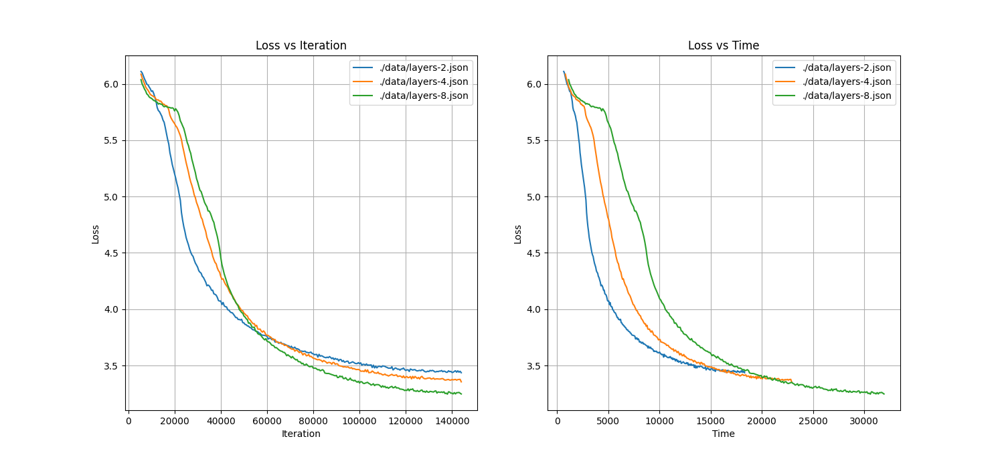
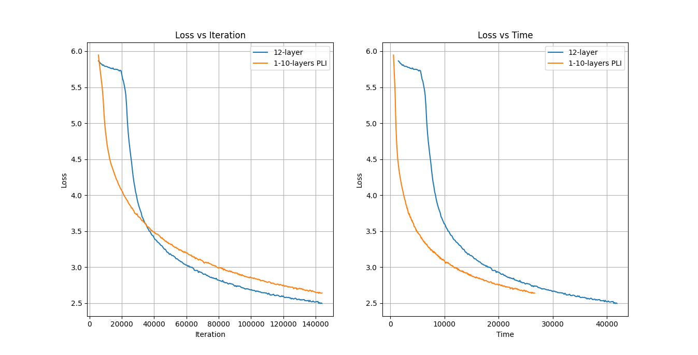
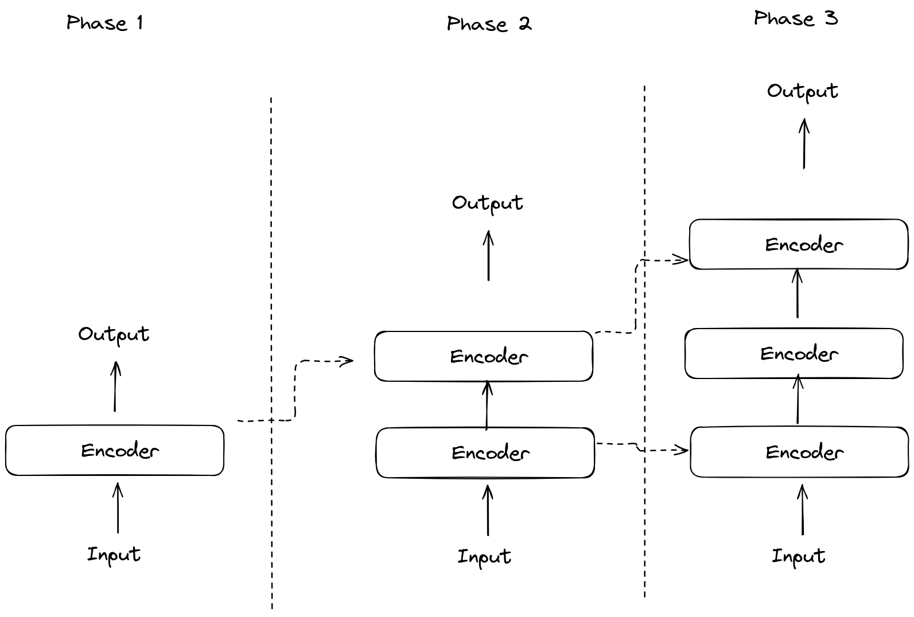

# Progressive Layer Increase

This project, proposes a technique for faster initial training for neural networks whose architecture includes repeating layers: Progressive Layer Increase (PLI). Despite focused in on pre-training transformers, PLI is general enough to be applied to a variety of architectures.

PLI is based on the following heuristics.

- Smaller NNs are faster to train, however faster to plateau,
- Larger NNs are slower to train, however given enough time reach better results.
- Transfer learning can provide a better starting point for training NNs than random initialization.


**FIGURE 1**: Training `Bert` with either `2`, `4`, or `8` layers. The y axis is the loss. The `x` axis on the left is the training iteration. The `x` axis on the right is the training duration.

This means that theoretically, during the initial phases of learning, there is no need to train the entire NN, since training a smaller network could lead to better results, more quickly. Then, after an appropriate amount of training, the NN could be gradually increased by adding more layers.


**FIGURE 2**: Training `Bert` with either `12` layers, or using PLI to gradually increase the number of layers from `1` to `10`. The y axis is the loss. The `x` axis on the left is the training iteration. The `x` axis on the right is the training duration. More details at the [appendix](#appendix).

As mention before, PLI works best when the network is built of repeating identical layers. For example: transformers. The core part of the transformers is a repeating sequence of either encoder or decoder blocks. During pre-training, PLI could be inserted into the training loop, and gradually increase the amount of layers periodically.



## Where & How to Insert?

When adding a new layer, two questions need to be asked:

- At which index should the layer be inserted at?
- How should the new layer be initialized.
  - It could either be created with random weights, or initialized by cloning the weights of another layer.

## Appendix

### Figure 2 - Training Parameters

```py
@dataclass
class HyperParameters:
    model_source: ModelSource = None
    data_source: DataSource = 'bookcorpus'
    model_initial_num_layers: Optional[int] = None
    model_patches: List[Patch] = field(default_factory=list)
    block_size: int = 128
    num_proc: int = 50
    mlm_probability: float = 0.1
    dataset_fraction: Optional[float] = None
    test_size: float = 0.05
    num_train_epochs: int = 1
    lr: float = 2e-5
    lr_end: float = 2e-5 * 2 / 3
    # examples: https://huggingface.co/docs/datasets/v1.11.0/splits.html#examples
    dataset_slice: Optional[str] = None
    per_device_train_batch_size: int = 32
    warmup_ratio: float = 0.025
    use_tensorboard = True

...

hyperparameters.model_initial_num_layers = 1
hyperparameters.model_patches = [
    # initial state: a                        tota: 1
    Patch(0.1, 1), # a b                      tota: 2
    Patch(0.2, 1), # a c b                    tota: 3
    Patch(0.3, 2), # a c d b                  tota: 4
    Patch(0.4, 2), # a c e d b                tota: 5
    Patch(0.5, 2), # a c f e d b              tota: 6
    Patch(0.6, 3), # a c f g e d b            tota: 7
    Patch(0.7, 3), # a c f h g e d b          tota: 8
    Patch(0.8, 3), # a c f i h g e d b        tota: 9
    Patch(0.9, 4), # a c f i j h g e d b      tota: 10
]
```

# TODO - Document

There are a few things we can do to round out this project:

1. Hyperparameter search - as mentioned at the [above](#where--how-to-insert) section, we have a lot of flexibility in choosing the insertion strategy. We could write a script that would launch several training processes, each with its own strategy and then compare them.
2. Expandability - We could run various expandability techniques on newly inserted layers, and previously shifted layers and see if there is a significant difference between them. For specifics, check out this [survey](https://dl.acm.org/doi/full/10.1145/3639372).
3. Metrics & Statistics - One of the metrics that HF exports to Tensorboard is the training gradient norm. One interesting observation is that the norm of `12-layer` run initially was greater than the `1-10-PLI` run. We could extract similar metrics. For example, we could load the model at different checkpoints, and plot their parameters using something like T-SNE in order to see how far newly inserted layers shift from their initialization, or to see if inserting a new layer somehow creates a "disturbance" for the other layers.

# TODO - Architecture

1. Add noise to new layers - basically, after creating a by cloning it from another, add some small amount of Gaussian noise to the its parameters.
2. L2 grad norm tracking - currently, HF already report s the L2 grad norm of the entire network, however I would also like us to have the l2 norms of the individual attention heads (and maybe of the fully connected layer as well).
3. Progressive head increase - just like we gradually add new layers during training, we can also start with a smaller amount of attention heads. There is actually quite a bit of research showing that fair amounts of the attention heads can be pruned without affecting the performance of the network.
4. Proper CLI - right now most of the configuration is done by changing hard coded parameters in the code. I would prefer to have a proper CLI using something like argparse and a Makefile with some presets.
5. Explore layer swap as a mean of regularization

# Resources & Paper

- [Are Sixteen Heads Really Better than One?](https://arxiv.org/abs/1905.10650v1)
- [Efficient Training of BERT by Progressively Stacking](https://proceedings.mlr.press/v97/gong19a/gong19a.pdf)
- [On the Transformer Growth for Progressive BERT Training](https://arxiv.org/abs/2010.12562)
- [A Primer in BERTology: What We Know About How BERT Works](https://direct.mit.edu/tacl/article/doi/10.1162/tacl_a_00349/96482/A-Primer-in-BERTology-What-We-Know-About-How-BERT)
